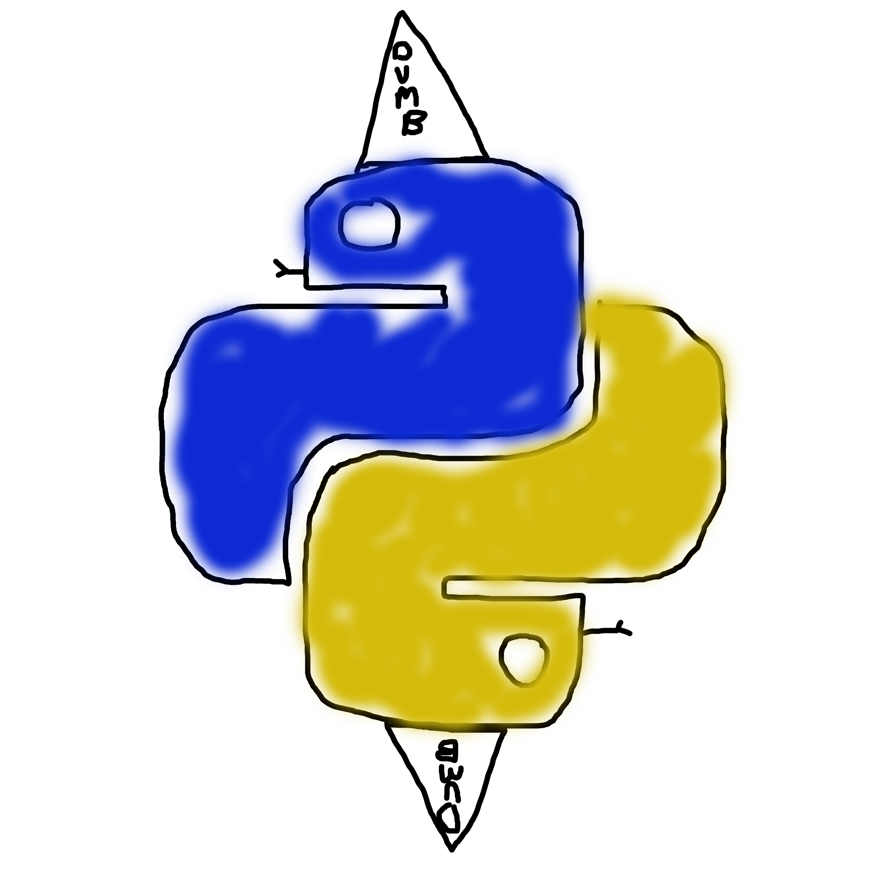

# dpython

[](https://github.com/CuckooEXE/dpython/actions/workflows/build.yml)



This is (dumb) Python, with a number of (dumb) enhancements that will make your life ~more confusing~ easier. This is a fork of `Python 3.12.0 alpha 0` (which was the `main` branch at time of forking, no real reason for this version). 

> Please don't actually use this, this is just me messing around with Python to learn its internals, and to learn more about programming languages.

## TODO

 - [ ] IP Addresses as native types
 - [ ] Integer increment operator
 - [x] `str` + `int` concatenation
 - [ ] `bytes` + `int` concatenation
 - [ ] Allow setting attributes of built-in/extension types

## Testing

```bash
./configure
make -j`nproc` test
```

## Features

### `str` + `int` concatenation

A former professor/employer/landlord and good friend of mine was frustrated that Python does not have the ability to implicitly cast integer types to string types when printing them out. For example, in JavaScript we can do:

```javascript
> '5 + 5 = ' + (5 + 5)
< '5 + 5 = 10'
```

(and yes, I'm aware of that chart of various implicit casting that JavaScript does). However, Python is a little more strict giving us this:

```python
>>> '5 + 5 = ' + (5 + 5)
Traceback (most recent call last):
  File "<stdin>", line 1, in <module>
TypeError: can only concatenate str (not "int") to str
```

Let's see if we can fix this. To start out, I should mention I've done this previously, but it's been years, and I no longer have the code; I'm fairly familiar with Python internals (more than the average developer using Python, much less than a Python developer). But to start, let's see if we can find the error in the Python source.

A quick search for "can only concatenate" results in a hit in `unicodeobject.c`:

```c
if (!PyUnicode_Check(right)) {
    PyErr_Format(PyExc_TypeError,
                  "can only concatenate str (not \"%.200s\") to str",
                  Py_TYPE(right)->tp_name);
    return NULL;
}
```

Trying our best to ignore Python's terrible style, we can see it checks to see if the RHS of the operation is a Unicode subclass, and if not, it'll throw this `TypeError`. The fact that this checks explicitly the RHS, and not the LHS made me try the following:

```python
>>> (5 + 5) + ' = 5 + 5'
Traceback (most recent call last):
  File "<stdin>", line 1, in <module>
TypeError: unsupported operand type(s) for +: 'int' and 'str'
```

So it looks like we'll have to handle two cases. More than likely we just go to the integer object's add method, and handle that case. For now, we'll focus on `str + int`, then `int + str`.

~~For the former case, I think I'll cast the RHS if it's not already a Unicode type, add it to the LHS Unicode, then destroy the cast (as to not leak memory).~~

So we don't have to cast after all, we can just get a new PyObject using `PyObject_Str` which basically calls `str(RHS)`, or `RHS.__str__()`. However, we'll test to see if the underlying `PyObject` is a `PyLong` (integer/number). Then we use that string `PyObject` as the new RHS. We'll still need to release it to ensure we don't leak memory. Remember, this code has to work, it doesn't have to be __that__ good :).

After building, we have 5 failed tests, but our feature works! It's more than likely that the tests __explicitly__ test that you can't concatenate `str + int` (or similar), so we'll have to change (or ignore :eyes:) those tests.

I'll go ahead and update the tests to make sure they reflect the changes I'm making to the Python codebase. Our failed tests are:

1. test_configparser
2. test_descr
3. test_enum
4. test_hashlib
5. test_unittest

Most of these were pretty straight-forward (simply correcting Python's (now-)false idea that `str + int` is not acceptable); however `test_enum` proved a more difficult challenge. Take the following code snippet (with a normal Python build):

```python
from enum import Enum, auto

class e(Enum):
    A = 'red'
    B = auto()
    C = auto()
```

In this case, `e.A == 'red'`, `e.B == 1`, `e.C == 2`, however, I was getting a failed assertion in `test_enum` that `e.B != 'red1'`. You might start to realize that the underlying code for `auto` grabs the last value and adds one to it. But since we made `str + int` cast to a string, this changes thing. The fix ended up specifically testing that the previous value was an `int`, and if not, continue down the line, in `Lib/enu.py:Enum.__generate_next_value_`.


```python
>>> '5 + 5 = ' + (5 + 5)
'5 + 5 = 10'
```

~~So we got `str + int`, let's work on the inverse. We probably have go into the `Objects/longobject.c` and inspect the function that is responsible for adding.~~

~~After CTRL+F'ing 'add', I saw `_PyLong_Add`, which is wrapped by a call to `long_add`, but I wasn't sure if this was the function, so to test if it was, I added the line to `Objects/longobject.c:lond_add`:~~

```c
if (PyUnicode_Check(a) || PyUnicode_Check(b))
    PyErr_Format(PyExc_TypeError,
              "special case: trying to concat \"%.200s\" and \"%.200s\"",
              Py_TYPE(a)->tp_name, Py_TYPE(b)->tp_name);
```

~~Interestingly enough, that broke my `str + int` code, but didn't even trigger `int + str`. I took another look at the error for `int + str`: `unsupported operand type(s) for +: ... `. The specific "for +" is making me think that Python is checking the types when it parses and detects the binary operator "+". Let's search for that code.~~ 

~~I searched for `unsupported operand type(s) for` which led me to `binop_type_error` (amongst others that I had to check), which was called by `PyNumber_Add` (figured this out because it called with with the operator being "+").~~

~~In this function, the first conditional simply checks if the Binary operator between the two types are implemented, if so, it returns that. If not, it checks if the LHS is a sequence, and if so, attempts to concatenate the RHS to it. Finally, it raises the binary operator error we're getting. So we need to treat the case that the LHS is a number, and the RHS is a sequence.~~

~~To do this, I'll essentially just copy and paste the code from check if the LHS is a sequence and modify it appropriately. This modification basically just consists of some sanity checking of types, and then another cast like in our `unicodeobject.c` case.~~

After implementing the `int + str` code, I got a bunch of failed tests (expected), but then I did some soul-searching... Should `int + str` really happen? My use-case for `str + int` is pretty obvious; you are printing out a status message that contains an integer, and you can't really be bothered by casting the str to an int. However I can't really find a good use-case for `int + str`, __unless__ your status message starts with an `int` which is just... weird. So I'm marking this feature complete!